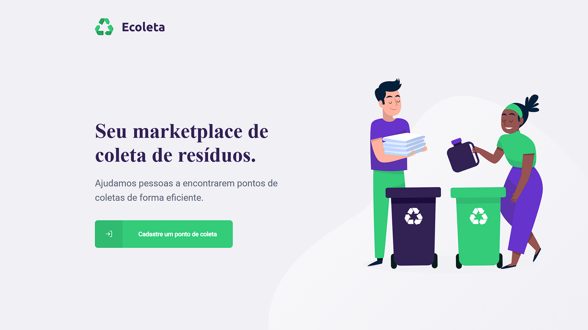
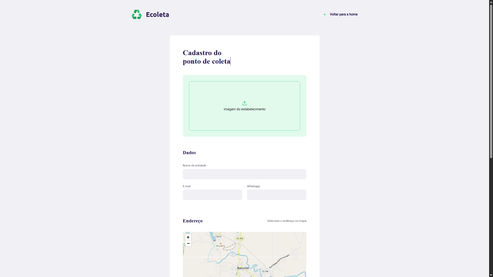
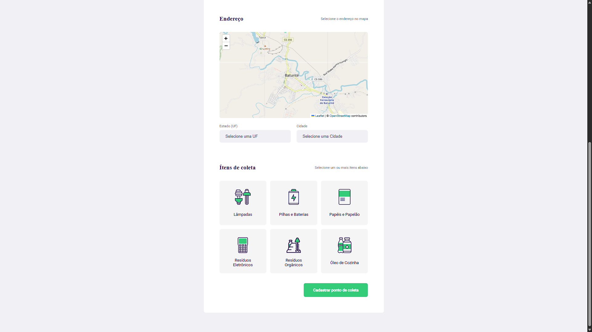

# <div align="center">♻️ Ecoleta</div>

<p align="center">
  O <strong>Ecoleta</strong> é um marketplace que ajuda pessoas a encontrarem pontos de coleta de resíduos de forma eficiente. Desenvolvido durante a Next Level Week (NLW) da Rocketseat, o projeto conecta entidades que coletam resíduos orgânicos e inorgânicos com pessoas que precisam descartar esses materiais.
</p>

## 🚀 Tecnologias

Esse projeto foi desenvolvido utilizando as seguintes tecnologias:

### Front-end (Web)
- ⚛️ [React](https://reactjs.org)
- ⚡ [Vite](https://vitejs.dev/)
- 🗺️ [Leaflet](https://leafletjs.com/) & [React Leaflet](https://react-leaflet.js.org/)
- 🌐 [Axios](https://github.com/axios/axios)
- 📥 [React Dropzone](https://react-dropzone.js.org/)

### Back-end (Server)
- 🟢 [Node.js](https://nodejs.org/en/)
- 🚂 [Express](https://expressjs.com/)
- 🗄️ [Knex.js](http://knexjs.org/) (com SQLite)
- 🦾 [TypeScript](https://www.typescriptlang.org/)
- 📤 [Multer](https://github.com/expressjs/multer)

## <div align="center">♻️ Funcionalidades</div>

- Cadastro de pontos de coleta (entidades).
- Upload de imagem do estabelecimento.
- Seleção de endereço via mapa interativo.
- Filtro de pontos por cidade, estado e itens de coleta (lâmpadas, pilhas, óleo, etc.).
- Listagem de pontos de coleta próximos.

## <div align="center">📸 Telas do projeto</div>

<p>🔸 Página Inicial</p>


<p>🔸 Cadastro de Ponto de Coleta - Dados</p>


<p>🔸 Cadastro de Ponto de Coleta - Endereço e Itens</p>


## <div align="center">⚙️ Como rodar localmente</div>

Clone o projeto e acesse a pasta raiz. É necessário rodar o **Back-end** para que o **Front-end** funcione corretamente.

> **⚠️ Importante:** O arquivo do banco de dados SQLite não é versionado no GitHub. Você **precisa** rodar as migrations e seeds abaixo para criar o banco localmente.

### 🖥️ Back-end (Servidor)

```bash
# Acesse a pasta do servidor
cd server

# Instale as dependências
npm install

# Execute as migrations para criar o banco de dados
npm run knex:migrate

# Execute os seeds para popular o banco com itens padrão
npm run knex:seed

# Rode o servidor de desenvolvimento
npm run dev

# O servidor iniciará na porta:3333 (padrão)
```

### 💻 Front-end (Web)

```bash
# Em outro terminal, acesse a pasta web
cd web

# Instale as dependências
npm install

# Rode o projeto web
npm run dev

# Acesse no navegador (geralmente http://localhost:5173 com Vite)
```

## 🤝 Contribuição

Sinta-se livre para usar, sugerir melhorias ou contribuir com este projeto. Toda colaboração é bem-vinda! 🚀

## 👨‍💻 Autor

Feito com dedicação e muito café! ☕🚀

---

<p align="center">
  Obrigado por acessar este projeto! 💜
</p>
